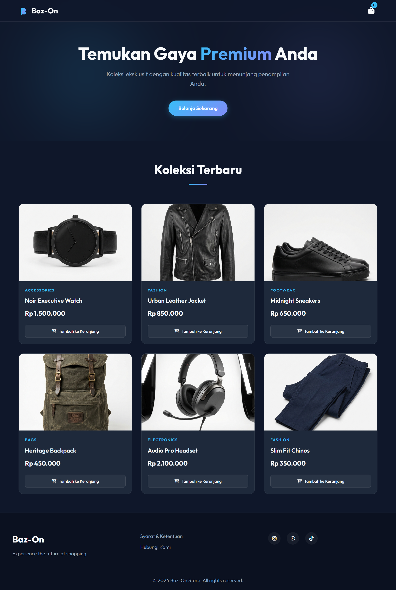

<div align="center">
  

  # Baz-On Store
  
  **A Premium Static E-Commerce Experience**
  
  [View Demo](https://aqles.github.io/baz-on)
  
  
  
  

  
</div>

---

## 🚀 About The Project

**Baz-On Store** is a modern, lightweight, and fully responsive static e-commerce website designed to provide a premium shopping experience without the complexity of a backend. It features a sleek glassmorphism design, smooth micro-interactions, and a unique "Checkout via WhatsApp" flow tailored for personalized customer service.

### ✨ Key Features

-   **🎨 Premium UI/UX**: Dark mode aesthetic with glassmorphism elements and smooth transitions.
-   **📱 Fully Responsive**: Optimized for all devices, from desktop monitors to mobile phones.
-   **🛒 LocalStorage Cart**: Persist shopping cart data across browser sessions.
-   **💬 WhatsApp Checkout**: Seamlessly generates a formatted order message and redirects to WhatsApp.
-   **⚡ Blazing Fast**: Pure static HTML/CSS/JS means zero server-side processing latency.
-   **📄 Informative Pages**: Includes dedicated Terms & Conditions and Contact Us pages.

## 🛠️ Tech Stack

-   **Core**: HTML5, Vanilla CSS3 (Custom Variables), Vanilla JavaScript (ES6+)
-   **Assets**: FontAwesome 6, Google Fonts (Outfit), Unsplash Images (Mockups)
-   **Design**: CSS Grid & Flexbox, Glassmorphism effects

## 📦 Installation & Setup

1.  **Clone the repository**
    ```bash
    git clone https://github.com/aqles/baz-on.git
    ```
2.  **Navigate to project directory**
    ```bash
    cd baz-on
    ```
3.  **Run locally**
    Simply open `index.html` in your preferred web browser. Alternatively, use a live server extension (vs-code) or simple python server:
    ```bash
    python -m http.server 8000
    ```

## 🔧 Customization

### Configuring Products
Edit `script.js` to modify the `products` array:

```javascript
const products = [
    {
        id: 1,
        name: "Your Product Name",
        price: 150000,
        category: "Category",
        image: "images/your-product.png",
        description: "Product description..."
    },
    // Add more products...
];
```

### Setting Admin Number
Update the `WHATSAPP_NUMBER` constant in `script.js`:

```javascript
const WHATSAPP_NUMBER = "6281234567890"; // Country code (62) + Number
```

## 📄 License

Distributed under the MIT License. See `LICENSE` for more information.

---

<div align="center">
  <p>Created by <a href="https://github.com/aqles">Aqles</a></p>
</div>
